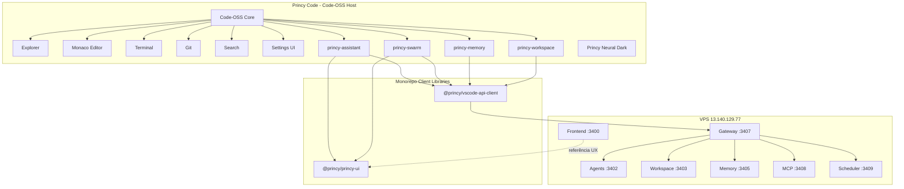
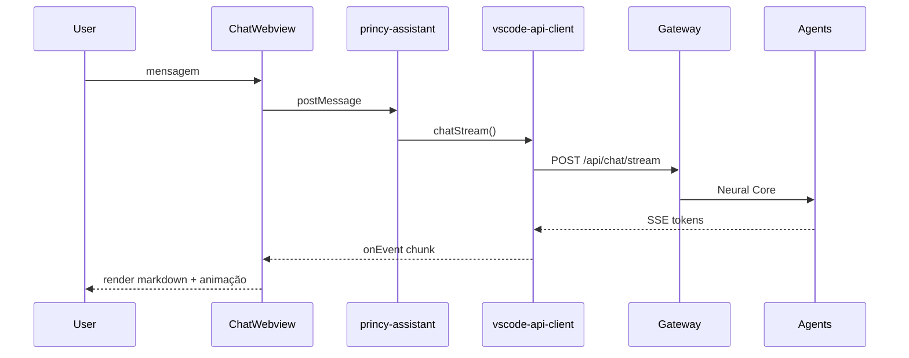
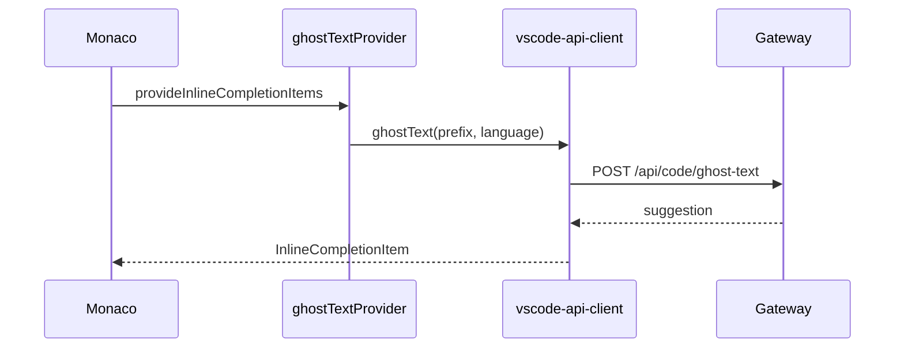
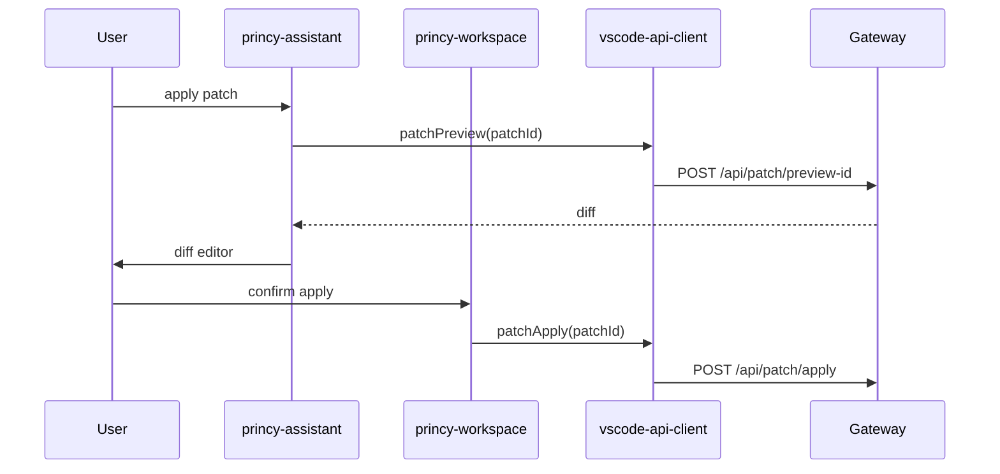
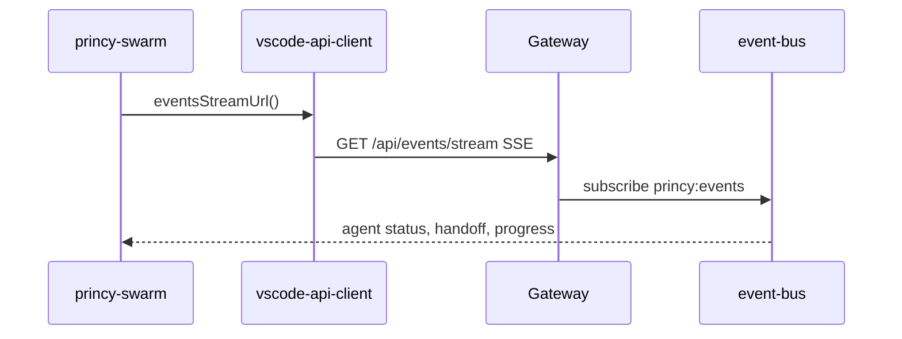
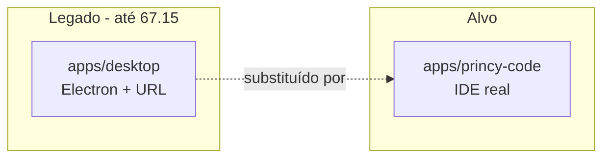

# FASE 67 — Arquitetura Princy Code IDE

Arquitetura alvo da IDE desktop baseada em Code-OSS com integração nativa aos serviços Princy AI.

---

## 1. Visão de camadas



---

## 2. Estrutura de diretórios alvo

```
apps/princy-code/
  vendor/vscode/              # git submodule microsoft/vscode @ tag pinado
  extensions/                 # built-in extensions (copiadas no patch)
    princy-assistant/         # migrado de apps/vscode-extension
    princy-swarm/             # sidebar swarm + animações
    princy-memory/            # memory panel
    princy-workspace/         # patches, diffs, rollback
  config/
    princy-services.json      # defaults de URLs produção
    product.overrides.json    # merges sobre product.json
  patches/                    # diffs mínimos upstream (se necessário)
  scripts/
    patch-code-oss.mjs        # branding + copy extensions + icons
    build-win.mjs
    build-linux.mjs
  assets/
    icon.ico, icon.png, splash, about
  product.json.template       # existente

packages/
  vscode-api-client/          # existente — HTTP/SSE
  princy-ui/                  # NOVO — React components para webviews

apps/vscode-extension/        # deprecated após 67.3 → symlink ou mirror
apps/desktop/                 # legado até 67.15
apps/frontend/                # referência UX + APIs web
```

---

## 3. Extensões built-in

### 3.1 `princy-assistant` (core)

Responsabilidades:

- Auth (SecretStorage)
- Chat sidebar (webview premium em 67.4)
- Ghost text (`InlineCompletionItemProvider`)
- Inline edit (Ctrl+K, Ctrl+Shift+K)
- Terminal IA hooks
- Activity bar container `princy-ai`
- Settings namespace `princy.*`
- Tema Princy Neural Dark (default)

Origem: migração de `apps/vscode-extension`.

### 3.2 `princy-swarm`

Responsabilidades:

- Sidebar Swarm dedicada
- SSE live pipeline (`eventsStreamUrl`, swarm APIs)
- Visual: agent pulse, neural links, handoff, timeline
- Agentes: Coordinator, Architect, Developer, Tester, Reviewer, DevOps

Depende: `@princy/vscode-api-client`, `@princy/princy-ui`.

### 3.3 `princy-memory`

Responsabilidades:

- Painel Memory: Project, Conversation, Code, Agent, Shared
- CRUD via gateway → memory-service `:3405`

### 3.4 `princy-workspace`

Responsabilidades:

- Arquivos afetados, patches, diffs
- Preview, apply, rollback
- Integração com explorer (decorations, gutter)

### 3.5 Extensões futuras (67.10–67.13)

Podem iniciar como webviews dentro de `princy-assistant` e split posterior:

- Marketplace panel
- MCP Center
- Observability
- Autonomous Mode

---

## 4. Configuração de servidores

### 4.1 Variáveis de ambiente / defaults

Arquivo proposto: `apps/princy-code/config/princy-services.json`

| Variável | Default produção | Serviço |
|----------|------------------|---------|
| `PRINCY_FRONTEND_URL` | `http://13.140.129.77:3400` | Next.js (referência UX) |
| `PRINCY_GATEWAY_URL` | `http://13.140.129.77:3407` | Gateway |
| `PRINCY_API_URL` | `http://13.140.129.77:3407` | Alias gateway |
| `PRINCY_AGENTS_URL` | `http://13.140.129.77:3402` | Neural Core |
| `PRINCY_WORKSPACE_URL` | `http://13.140.129.77:3403` | Workspace / Patch |
| `PRINCY_MEMORY_URL` | `http://13.140.129.77:3405` | Memory |
| `PRINCY_SCHEDULER_URL` | `http://13.140.129.77:3409` | Scheduler |
| `PRINCY_MCP_URL` | `http://13.140.129.77:3408` | MCP |

### 4.2 Mapeamento VS Code Settings (67.14)

| Setting key | Default | Descrição |
|-------------|---------|-----------|
| `princy.gatewayUrl` | `http://13.140.129.77:3407/api` | Base API (extensão atual) |
| `princy.frontendUrl` | `http://13.140.129.77:3400` | Links externos / help |
| `princy.agentsUrl` | `http://13.140.129.77:3402` | Direct agents (debug) |
| `princy.memoryUrl` | `http://13.140.129.77:3405` | Direct memory (debug) |
| `princy.enableGhostText` | `true` | Ghost text toggle |
| `princy.enableAutonomousMode` | `false` | Autonomous opt-in |
| `princy.ghostTextDebounceMs` | `500` | Debounce ghost |

Extensões usam **gateway** como ponto principal; URLs diretas apenas para debug ou features que bypass gateway no futuro.

---

## 5. Neural Router — mapeamento de modelos

Backend: `packages/shared/src/router` + `packages/model-router`.

| Tarefa IDE | Modelo | Endpoint típico |
|------------|--------|-----------------|
| Ghost text | `qwen2.5:3b` | `POST /api/code/ghost-text` |
| Chat simples, explain | `qwen2.5:3b` / routed | `POST /api/chat/stream` |
| Refactor, tests, codegen | `qwen3:8b` | `POST /api/code/refactor`, `/api/code/tests` |
| Swarm, autonomous, architect | `deepseek-r1:8b` | `POST /api/swarm/*`, `/api/agents/autonomous/run` |
| Embeddings | `nomic-embed-text` | workspace index |

A extensão **não seleciona modelo** — o gateway/router decide. Settings exibem modelo routed (read-only).

---

## 6. Fluxos principais

### 6.1 Chat streaming



### 6.2 Ghost text



### 6.3 Patch apply



### 6.4 Swarm live



---

## 7. UI compartilhada — `packages/princy-ui`

### Objetivo

Evitar duplicação entre `apps/frontend` e webviews da IDE.

### Componentes candidatos (extraídos do frontend)

| Componente | Origem | Uso IDE |
|------------|--------|---------|
| `ChatMessage` | `features/chat/ChatMessage.tsx` | Chat webview |
| `ChatInput` | `features/chat/ChatInput.tsx` | Chat webview |
| `ThinkingBlock` | novo (spec 67) | Chat + inline |
| `SwarmOrbit` | `features/swarm/components/` | Swarm panel |
| `NeuralLinksLayer` | `features/swarm/components/` | Swarm animações |
| `DiffViewer` | `features/editor/DiffViewer.tsx` | Patch preview |
| `ToolCallCard` | novo | Chat tool calls |
| `MemoryScopePanel` | `features/memory/` | Memory sidebar |

### Build webview

- esbuild bundle por extensão
- React 18 + CSS modules ou Tailwind subset
- `@vscode/webview-ui-toolkit` para inputs nativos onde aplicável
- **Sem iframe VPS** — UI local, dados via api-client

---

## 8. Atalhos de teclado (spec FASE 67)

| Comando | Atalho proposto | Extensão |
|---------|-----------------|----------|
| Princy: Open Chat | `Ctrl+Shift+P` → ou custom | princy-assistant |
| Princy: Explain Selection | `Ctrl+K` (contextual) | princy-assistant |
| Princy: Refactor Selection | palette | princy-assistant |
| Princy: Generate Tests | palette | princy-assistant |
| Inline edit expandido | `Ctrl+Shift+K` | princy-assistant |
| Princy: Open Swarm | palette | princy-swarm |
| Princy: Open Memory | palette | princy-memory |
| Princy: Open Marketplace | palette | princy-assistant (67.10) |
| Princy: Run Autonomous Task | palette | princy-assistant (67.13) |
| Command palette Princy | `Ctrl+K` global (Code-OSS) | host + ext |

Nota: resolver conflito `Ctrl+K` entre chord do VS Code e inline edit — usar `when` clauses e keybinding priority.

---

## 9. Aparência — Princy Neural Dark

Tema existente: `apps/vscode-extension/themes/princy-dark-neural.json`

Características alvo:

- Glassmorphism em painéis webview (CSS)
- Glow/neon em bordas ativas (swarm, thinking)
- Animações CSS/GPU — sem bloquear editor thread
- Performance: `will-change`, `transform` only, debounce animações

Default theme via `product.json`:

```json
"defaultExtensionKind": { "princy-ai.princy-assistant": ["ui"] }
```

Workbench color customizations em patch ou theme extension.

---

## 10. Segurança

| Aspecto | Implementação |
|---------|---------------|
| Auth token | VS Code `SecretStorage` |
| File guard | `src/security/fileGuard.ts` — bloqueia `.env`, keys |
| Webview | CSP restritivo, `enableScripts: true`, no remote code |
| Patch apply | Confirmação usuário; autonomous opt-in |
| HTTPS | Produção VPS; dev localhost permitido via settings |
| Telemetry | Desabilitar Microsoft telemetry no product.json |

---

## 11. Relação com apps/desktop (legado)



`apps/desktop` permanece no repo até 67.15 como fallback; instalador oficial migra para Code-OSS build.

---

## 12. Referências

- [FASE-67-AUDITORIA.md](./FASE-67-AUDITORIA.md)
- [FASE-67-CODE-OSS-STRATEGY.md](./FASE-67-CODE-OSS-STRATEGY.md)
- [ARQUITETURA-IA.md](./ARQUITETURA-IA.md)
- [VSCODE-EXTENSION.md](./VSCODE-EXTENSION.md)
