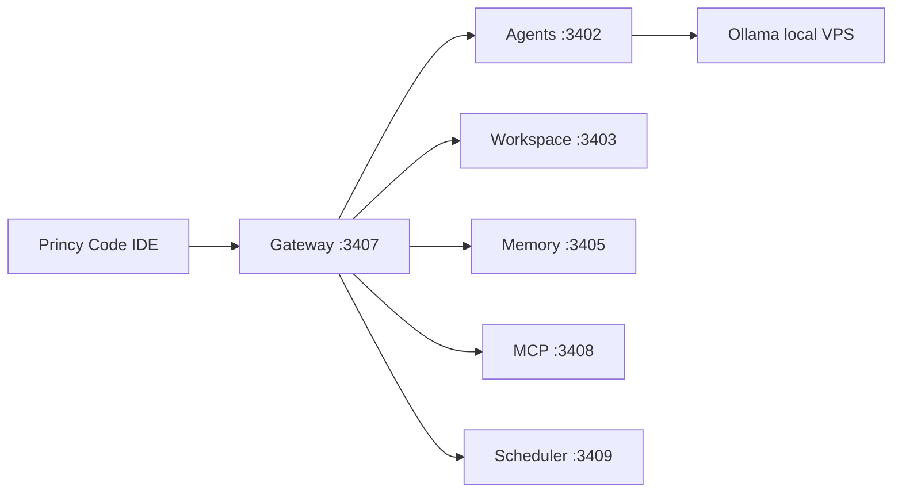

# FASE 67 — Princy Code Desktop Real (Code-OSS + Princy AI)

Documento mestre da FASE 67. Define visão, escopo, decisões de produto e links para subdocumentos.

## Visão

Criar uma **IDE desktop profissional** baseada em **Code-OSS** (VS Code Open Source), transformando-a no produto oficial **Princy Code**.

A experiência deve ser comparável às melhores IDEs com IA do mercado, utilizando como motores centrais:

- Princy AI (Neural Core)
- Neural Router
- Swarm (10 agentes)
- Memory
- Workspace Intelligence
- Marketplace
- MCP
- Autonomous Projects

**Não é objetivo:** Electron shell que apenas abre uma URL do frontend web.

**É objetivo:** aplicativo desktop real com Explorer, Tabs, Monaco, Terminal, Git, Search, Extensions, Settings e IA integrada nativamente.

## Decisões de produto (confirmadas)

| Decisão | Escolha |
|---------|---------|
| Base técnica | Code-OSS (`microsoft/vscode` via submodule) |
| Produto principal | `apps/princy-code` — IDE fork |
| Electron shell (`apps/desktop`) | Legado transitório até 67.15 |
| Instalador oficial | `Princy-Code-Setup.exe` (Windows), AppImage (Linux) |
| Backend | VPS Princy (`13.140.129.77`) — gateway `:3407` |
| Branding | Princy Code — sem Microsoft / Copilot / Cursor |
| Extensões | Built-in no fork; evolução de `apps/vscode-extension` → `extensions/princy-*` |

## Objetivo do produto

Princy Code deve ser:

- Editor principal
- IDE principal
- Ambiente de desenvolvimento principal

Instalável via `Princy-Code-Setup.exe` com:

| Capability | Origem |
|------------|--------|
| Explorer, Tabs, Search, Settings | Code-OSS core |
| Monaco editor | Code-OSS core |
| Terminal integrado | Code-OSS core |
| Git | Code-OSS + extensões built-in |
| Extensions | Marketplace Princy + VS Code compat |
| Chat Princy | `princy-assistant` |
| Swarm, Memory, Workspace | Extensões Princy dedicadas |
| Ghost text / Inline AI | `princy-assistant` + Neural Router |
| Tema default | Princy Neural Dark |

## Motores Princy (backend remoto)

Todo tráfego de IA passa pelo gateway Princy — sem Copilot, Cursor ou serviços proprietários de terceiros na UI.

Referência completa: [ARQUITETURA-IA.md](./ARQUITETURA-IA.md), [URLS-PRODUCAO.md](./URLS-PRODUCAO.md).

## Estado atual vs alvo

| Aspecto | Hoje (pré-67.1) | Alvo FASE 67 |
|---------|-----------------|--------------|
| IDE nativa | Não — VSIX externo ou Electron URL | Code-OSS custom |
| Scaffold | `apps/princy-code` (3 arquivos) | Build completo |
| UX Chat/Swarm | Rica no web; básica na extensão | Premium na IDE |
| Instalador | Electron shell (79 MB) | Code-OSS NSIS |
| Extensões split | Monólito `apps/vscode-extension` | `princy-assistant`, `princy-swarm`, etc. |

## Documentação FASE 67

| Documento | Conteúdo |
|-----------|----------|
| [FASE-67-AUDITORIA.md](./FASE-67-AUDITORIA.md) | Inventário do repositório |
| [FASE-67-ARQUITETURA.md](./FASE-67-ARQUITETURA.md) | Camadas, config, extensões, APIs |
| [FASE-67-CODE-OSS-STRATEGY.md](./FASE-67-CODE-OSS-STRATEGY.md) | Submodule, patches, build, CI, legal |
| [FASE-67-ROADMAP-67.1-67.15.md](./FASE-67-ROADMAP-67.1-67.15.md) | Subfases, critérios de aceite, esforço |
| [PRINCY-CODE.md](./PRINCY-CODE.md) | Visão de produto (Phase 1 + 2) |

## Subfases internas (67.1–67.15)

| ID | Nome | Resumo |
|----|------|--------|
| 67.1 | Preparar Code-OSS | Submodule, compile, patch script |
| 67.2 | Branding completo | Ícones, About, welcome, zero VS Code |
| 67.3 | Princy Assistant | Extensão built-in, auth, chat base |
| 67.4 | Chat Premium | Streaming, Mermaid, animações, thinking UI |
| 67.5 | Ghost Text | Neural Router, modelos por tarefa |
| 67.6 | Inline Edit | Ctrl+K, refactor, tests, diff apply |
| 67.7 | Swarm Sidebar | Agentes live, animações neurais |
| 67.8 | Memory Sidebar | Scopes, CRUD visual |
| 67.9 | Workspace Intelligence | Patches, diffs, rollback |
| 67.10 | Marketplace | Agents, Tools, Templates, Themes, MCP |
| 67.11 | MCP Center | Status, config, testes, logs |
| 67.12 | Observability | Router, cache, swarm, scheduler |
| 67.13 | Autonomous Mode | Goal → Deploy, timeline, aprovações |
| 67.14 | Settings | URLs, modelos, aparência |
| 67.15 | Build Final | NSIS, AppImage, CI, deprecar Electron shell |

Detalhes: [FASE-67-ROADMAP-67.1-67.15.md](./FASE-67-ROADMAP-67.1-67.15.md).

## Estimativa consolidada

| Métrica | Valor |
|---------|-------|
| Total | ~27 semanas-pessoa |
| 1 dev | ~6–7 meses |
| 2 devs | ~3,5–4 meses |
| MVP (67.1–67.6) | ~11 semanas |

## Escopo desta entrega (FASE 67 — documentação)

Esta execução entrega **apenas documentação e plano técnico**:

- Auditoria completa
- Arquitetura ideal
- Estratégia Code-OSS
- Roadmap 67.1–67.15 com estimativas

**Não inclui:** submodule, build, alteração funcional de código, commit automático.

## Próximo passo

Aguardar **aprovação humana** para iniciar **67.1** (submodule `vendor/vscode` + primeiro compile local).

## Relacionados

- Phase 1 (VSIX): [VSCODE-EXTENSION.md](./VSCODE-EXTENSION.md)
- Electron shell (legado): [FASE-32-ELECTRON-DESKTOP.md](./FASE-32-ELECTRON-DESKTOP.md)
- Release 1.0: [FASE-65-RELEASE-1.0.md](./FASE-65-RELEASE-1.0.md)
