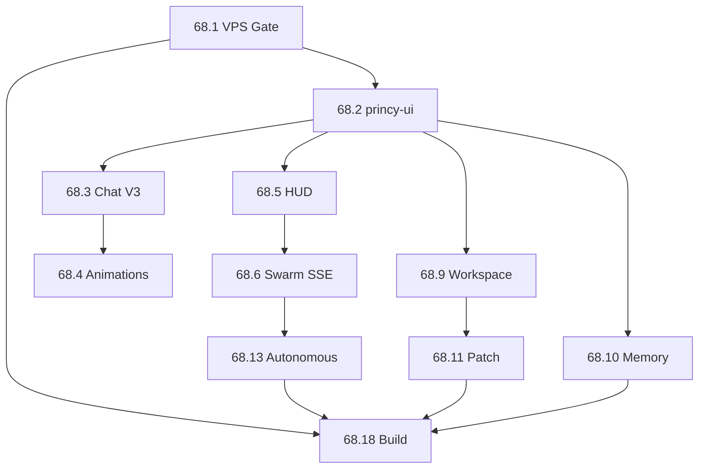

# FASE 68 — Arquivos (create/modify)

Lista de arquivos por módulo e subfase. Referência para implementação 68.1–68.18.

---

## Resumo

| Ação | Quantidade |
|------|------------|
| Criar | ~25+ arquivos |
| Modificar | ~20+ arquivos |

---

## Criar

### `packages/princy-ui/` (68.2)

```
packages/princy-ui/package.json
packages/princy-ui/tsconfig.json
packages/princy-ui/scripts/build-webview.mjs
packages/princy-ui/src/index.ts
packages/princy-ui/src/tokens/colors.ts
packages/princy-ui/src/tokens/typography.ts
packages/princy-ui/src/components/ChatMessage.tsx
packages/princy-ui/src/components/ThinkingPanel.tsx
packages/princy-ui/src/components/AgentOrbitalCard.tsx
packages/princy-ui/src/components/DiffViewer.tsx
packages/princy-ui/src/components/MetricCounter.tsx
packages/princy-ui/src/animations/index.ts
packages/princy-ui/src/animations/typing.ts
packages/princy-ui/src/animations/thinking.ts
packages/princy-ui/src/animations/streaming-cursor.ts
packages/princy-ui/src/animations/tool-running.ts
packages/princy-ui/src/animations/agent-working.ts
packages/princy-ui/src/animations/patch-applying.ts
packages/princy-ui/src/animations/memory-loading.ts
packages/princy-ui/src/animations/workspace-scan.ts
packages/princy-ui/src/animations/autonomous-execution.ts
packages/princy-ui/src/animations/task-complete.ts
```

### Extensão — novos módulos

```
apps/vscode-extension/src/config/validate-urls.ts          # 68.1
apps/vscode-extension/src/webviews/hud/agentHudPanel.ts      # 68.5
apps/vscode-extension/src/webviews/startup/startupHubPanel.ts  # 68.16
apps/vscode-extension/src/webviews/settings/settingsPanel.ts   # 68.15
apps/vscode-extension/src/webviews/patch/patchPanel.ts         # 68.11
```

### Build e scripts

```
apps/princy-code/scripts/build-portable.mjs                  # 68.18
scripts/princy-perf-benchmark.mjs                            # 68.17
```

### Documentação FASE 68

```
docs/FASE-68-PRINCY-CODE-ULTIMATE.md
docs/FASE-68-AUDITORIA.md
docs/FASE-68-ROADMAP-68.1-68.18.md
docs/FASE-68-ARQUIVOS.md
```

---

## Modificar

### 68.1 — VPS hardening

| Arquivo | Mudança |
|---------|---------|
| `packages/extension-shared/src/config.ts` | Adicionar `contextUrl`, `automationUrl`; helpers validation |
| `apps/princy-code/config/princy-services.json` | URLs :3404, :3406 |
| `apps/vscode-extension/src/princyClient.ts` | Propagar novas URLs |
| `apps/vscode-extension/src/extension.ts` | Startup health probe + validate URLs |

### 68.2–68.6 — Webviews React migration

| Arquivo | Mudança |
|---------|---------|
| `apps/vscode-extension/src/webviews/chat/chatPanel.ts` | React bundle via princy-ui |
| `apps/vscode-extension/src/webviews/swarm/swarmPanel.ts` | React + SSE |
| `apps/vscode-extension/src/webviews/memory/memoryPanel.ts` | React CRUD |
| `apps/vscode-extension/src/webviews/workspace/workspacePanel.ts` | Dashboard + wire buttons |
| `apps/vscode-extension/src/webviews/marketplace/marketplacePanel.ts` | Search + states |
| `apps/vscode-extension/src/webviews/mcp/mcpPanel.ts` | Real test, logs |
| `apps/vscode-extension/src/webviews/observability/observabilityPanel.ts` | Charts |
| `apps/vscode-extension/src/webviews/autonomous/autonomousPanel.ts` | Timeline SSE |

### 68.3 — API client

| Arquivo | Mudança |
|---------|---------|
| `packages/vscode-api-client/src/client.ts` | `conversationsList`, `conversationHistory`, memory CRUD, MCP test/logs, autonomous SSE |

### 68.4 — Animações

| Arquivo | Mudança |
|---------|---------|
| `packages/extension-shared/src/premium-ui.ts` | Integrar animation tokens |
| `packages/princy-ui/src/animations/*` | 10 animações spec |

### 68.7 — Inline AI

| Arquivo | Mudança |
|---------|---------|
| `apps/vscode-extension/src/providers/inlineChat.ts` | Widget inline |
| `apps/vscode-extension/package.json` | Menus, keybindings, 3 novos commands |

### 68.8 — Ghost text

| Arquivo | Mudança |
|---------|---------|
| `apps/vscode-extension/src/providers/ghostText.ts` | Debounce 200ms, cancel, status bar |

### 68.9–68.11 — Workspace / Patch

| Arquivo | Mudança |
|---------|---------|
| `apps/vscode-extension/src/patch/preview.ts` | Multi-file, reject |
| `apps/vscode-extension/src/webviews/workspace/workspacePanel.ts` | Auto-detect, decorations |

### 68.12 — Terminal

| Arquivo | Mudança |
|---------|---------|
| `apps/vscode-extension/src/terminal/monitor.ts` | Structured logs, generate cmd |

### 68.13 — Autonomous

| Arquivo | Mudança |
|---------|---------|
| `apps/vscode-extension/src/webviews/autonomous/autonomousPanel.ts` | Full flow + cancel |

### 68.15 — Settings

| Arquivo | Mudança |
|---------|---------|
| `apps/vscode-extension/package.json` | 9 categorias configuration |
| `apps/vscode-extension/src/webviews/settings/settingsPanel.ts` | Import/export UI |

### 68.16 — Startup

| Arquivo | Mudança |
|---------|---------|
| `apps/princy-code/assets/welcome.html` | Redirect hub ou embed |

### 68.17 — Security

| Arquivo | Mudança |
|---------|---------|
| `apps/vscode-extension/src/auth.ts` | Refresh token flow |
| `apps/vscode-extension/src/security/fileGuard.ts` | RBAC gates |

### 68.18 — Build

| Arquivo | Mudança |
|---------|---------|
| `apps/princy-code/scripts/build-win.mjs` | Remove soft-fail |
| `apps/princy-code/scripts/build-linux.mjs` | Verified AppImage |
| `.github/workflows/princy-code-build.yml` | Remove `continue-on-error` |

---

## Mapa subfase → arquivos

| Subfase | Criar | Modificar |
|---------|-------|-----------|
| 68.1 | `validate-urls.ts` | config.ts, princy-services.json, extension.ts |
| 68.2 | `packages/princy-ui/**` | — |
| 68.3 | — | chatPanel.ts, client.ts |
| 68.4 | animations/* | premium-ui.ts |
| 68.5 | agentHudPanel.ts | swarmPanel.ts |
| 68.6 | — | swarmPanel.ts, client.ts |
| 68.7 | — | inlineChat.ts, package.json |
| 68.8 | — | ghostText.ts |
| 68.9 | — | workspacePanel.ts |
| 68.10 | — | memoryPanel.ts, client.ts |
| 68.11 | patchPanel.ts | preview.ts, workspacePanel.ts |
| 68.12 | — | monitor.ts |
| 68.13 | — | autonomousPanel.ts, client.ts |
| 68.14 | — | mcpPanel.ts, observabilityPanel.ts, marketplacePanel.ts |
| 68.15 | settingsPanel.ts | package.json |
| 68.16 | startupHubPanel.ts | welcome.html |
| 68.17 | princy-perf-benchmark.mjs | auth.ts, fileGuard.ts |
| 68.18 | build-portable.mjs | build-win.mjs, princy-code-build.yml |

---

## Dependências entre módulos



---

## Referências

- [FASE-68-PRINCY-CODE-ULTIMATE.md](./FASE-68-PRINCY-CODE-ULTIMATE.md)
- [FASE-68-AUDITORIA.md](./FASE-68-AUDITORIA.md)
- [FASE-68-ROADMAP-68.1-68.18.md](./FASE-68-ROADMAP-68.1-68.18.md)
