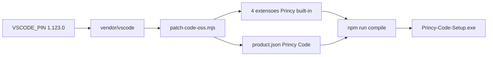

# FASE 68 — Code-OSS Modernization

## Decisão

Migrar o vendor Code-OSS de **1.96.2** para **1.123.0** para suportar APIs modernas de Chat, Language Model e extensões Princy sem remover funcionalidades.

## Motivo

O build em 1.96.2 falhava com conflitos de tipos em `src/vscode-dts/vscode.d.ts` (Chat/Language Model APIs). A base antiga não alinhava com o nível de funcionalidades IA do Princy Code.

## Arquitetura pós-migração



## Requisitos de build (1.123.0)

| Ferramenta | Versão |
|------------|--------|
| Node.js | **24.15.0+** (`nvm use 24.15.0`) |
| npm | 10.x (< 12 no vendor) |
| Python | 3.11 |
| Visual Studio Build Tools 2022 | MSVC + **C++ Clang tools (ClangCL)** |
| RAM | 16 GB recomendado |

## Pipeline npm-only

Scripts Princy migrados de yarn para npm:

- `npm ci` no vendor
- `npm run compile`
- `npx gulp vscode-win32-x64-min-ci`

## Preservação Princy

- Branding: Princy Code, protocolo `princy-code://`
- Extensões: princy-assistant, princy-swarm, princy-memory, princy-workspace
- URLs VPS: `13.140.129.77:3400–3409` (sem localhost)
- Sem Copilot, sem Cursor na UI

## Comandos

```powershell
nvm use 24.15.0
cd D:\Projetos\Princy-AI-Editor
npm run princy-code:init-submodule
npm run princy-code:sync
npm run princy-code:patch
npm run princy-code:compile
npm run princy-code:build:win
```

## Referências

- [VSCODE_PIN.md](../apps/princy-code/VSCODE_PIN.md)
- [PRINCY-CODE-BUILD-FIX-D.md](./build-notes/PRINCY-CODE-BUILD-FIX-D.md)
- [FASE-68-CODE-OSS-MODERNIZATION-REPORT.md](./FASE-68-CODE-OSS-MODERNIZATION-REPORT.md)
