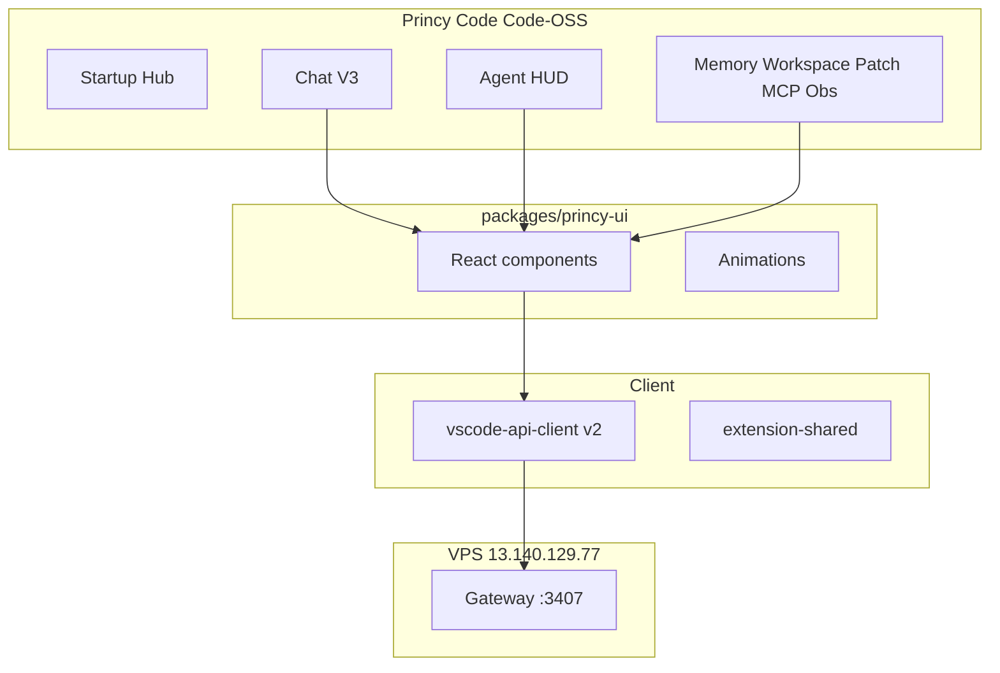

# FASE 68 — Princy Code Ultimate Desktop

Documento mestre da FASE 68. Define visão, princípios, objetivo de experiência e links para subdocumentos.

## Visão

Transformar **Princy Code** em uma IDE desktop profissional baseada em **Code-OSS** com experiência de desenvolvimento assistido por IA de **nível premium**.

A implementação utiliza componentes, identidade e arquitetura próprios da Princy — sem dependência de Copilot, Cursor ou serviços proprietários de terceiros.

O usuário deve sentir que está utilizando:

- IDE profissional nativa (Explorer, Monaco, Terminal, Git)
- Assistente IA integrado
- Agentes autônomos (Swarm)
- Memória persistente
- Edição inteligente e ghost text
- Geração e análise de código
- Automação end-to-end

## Princípio fundamental: VPS-only

**Não utilizar `localhost` nem `127.0.0.1`.** Toda comunicação da IDE ocorre com serviços hospedados no VPS.

| Serviço | URL oficial |
|---------|-------------|
| Frontend | `http://13.140.129.77:3400` |
| Gateway | `http://13.140.129.77:3407` |
| Agents (Neural Core) | `http://13.140.129.77:3402` |
| Workspace | `http://13.140.129.77:3403` |
| Context Graph | `http://13.140.129.77:3404` |
| Memory | `http://13.140.129.77:3405` |
| Automation | `http://13.140.129.77:3406` |
| MCP | `http://13.140.129.77:3408` |
| Scheduler | `http://13.140.129.77:3409` |

Validação em settings deve **rejeitar** URLs loopback. Referência: [ARQUITETURA-IA.md](./ARQUITETURA-IA.md).

## Estado de partida (pós-FASE 67)

| Camada | Status |
|--------|--------|
| Extensão v1.0.0 | Compila; 7 painéis webview (HTML básico) |
| VPS-only na extensão | OK — zero loopback em `apps/vscode-extension` |
| Code-OSS scripts | Patch, sync, build — **sem `vendor/vscode` clonado** |
| UX premium | Parcial — gap vs frontend web |
| `packages/princy-ui` | **Não existe** |

Ver auditoria completa: [FASE-68-AUDITORIA.md](./FASE-68-AUDITORIA.md).

## Módulos FASE 68

| Módulo | Objetivo |
|--------|----------|
| **Princy Chat V3** | Sidebar fixa, streaming, markdown, tool calls, histórico |
| **Animações** | Typing, thinking, tool running, agent working, patch, memory, scan |
| **Thinking Panel** | Objetivo, plano, etapas, ferramentas, agentes, tokens |
| **Agent HUD** | 6 agentes com modelo, latência, artefatos |
| **Neural Links** | Handoff animado, task flow, SSE |
| **Inline AI V2** | Ctrl+K/L, widget inline, 10+ code actions |
| **Ghost Text** | qwen2.5:3b, meta **<300ms** |
| **Workspace Intelligence** | Auto-detect stack, dashboard técnico |
| **Memory Center** | 6 scopes, CRUD, search |
| **Patch Engine** | Diff profissional, apply/reject/rollback |
| **Terminal AI V2** | Logs estruturados, generate command, retry |
| **Swarm Execution** | Goal→Plan→timeline, SSE, aprovações |
| **Autonomous Mode V2** | Fluxo completo com deploy |
| **MCP Center** | Test real, logs, latência, config |
| **Observability** | Charts, router, cache, workers, scheduler |
| **Marketplace** | Search, templates, themes polish |
| **Settings V2** | 9 categorias, import/export |
| **Design System** | `packages/princy-ui` — glass, glow, neural |
| **Startup Experience** | Hub: projects, swarm runs, health |
| **Performance** | TTFT <2s, ghost <300ms, scan <5s, memory <1s |
| **Security** | JWT refresh, RBAC, permission gates |
| **Build Ultimate** | `.exe`, AppImage, Portable |

## Arquitetura alvo

**Decisão:** criar `packages/princy-ui` extraindo componentes de `apps/frontend` — bundle esbuild para webviews.

## Subfases (68.1–68.18)

| ID | Nome | Esforço |
|----|------|---------|
| 68.1 | Gate Code-OSS + VPS hardening | 1,5 sem |
| 68.2 | `packages/princy-ui` foundation | 2,5 sem |
| 68.3 | Princy Chat V3 | 3 sem |
| 68.4 | Animation system | 1 sem |
| 68.5 | Thinking Panel + Agent HUD | 2,5 sem |
| 68.6 | Neural Links + Swarm SSE | 2 sem |
| 68.7 | Inline AI V2 + Advanced actions | 2 sem |
| 68.8 | Ghost text performance | 1 sem |
| 68.9 | Workspace Intelligence dashboard | 2,5 sem |
| 68.10 | Memory Center | 2 sem |
| 68.11 | Patch Engine professional | 1,5 sem |
| 68.12 | Terminal AI V2 | 1 sem |
| 68.13 | Autonomous Mode V2 | 2,5 sem |
| 68.14 | MCP + Observability + Marketplace V2 | 2,5 sem |
| 68.15 | Settings V2 | 1 sem |
| 68.16 | Startup Experience | 1,5 sem |
| 68.17 | Security + Performance | 1,5 sem |
| 68.18 | Build Ultimate | 2 sem |

Detalhes: [FASE-68-ROADMAP-68.1-68.18.md](./FASE-68-ROADMAP-68.1-68.18.md).

## Estimativa consolidada

| Métrica | Valor |
|---------|-------|
| Total | ~30 semanas-pessoa |
| 1 dev | ~7–8 meses |
| 2 devs | ~4 meses |
| MVP Ultimate (68.1–68.3, 68.5–68.6, 68.18) | ~12 semanas |

## Metas de performance

| Operação | Meta |
|----------|------|
| Chat TTFT | < 2s |
| Ghost text | < 300ms p95 |
| Workspace scan | < 5s |
| Memory load | < 1s |

## Produto final

| Artefato | Plataforma |
|----------|------------|
| `Princy-Code-Setup.exe` | Windows NSIS |
| `Princy-Code.AppImage` | Linux |
| `Princy-Code-Portable.zip` | Windows portable |

## Documentação FASE 68

| Documento | Conteúdo |
|-----------|----------|
| [FASE-68-AUDITORIA.md](./FASE-68-AUDITORIA.md) | Gap analysis pós-FASE 67 |
| [FASE-68-ROADMAP-68.1-68.18.md](./FASE-68-ROADMAP-68.1-68.18.md) | Subfases, aceite, esforço |
| [FASE-68-ARQUIVOS.md](./FASE-68-ARQUIVOS.md) | Arquivos create/modify |

## Relacionados

- FASE 67: [FASE-67-PRINCY-CODE-DESKTOP.md](./FASE-67-PRINCY-CODE-DESKTOP.md)
- Produto: [PRINCY-CODE.md](./PRINCY-CODE.md)
- IA: [ARQUITETURA-IA.md](./ARQUITETURA-IA.md)

## Próximo passo

Aguardar **aprovação humana** para iniciar **68.1** (submodule Code-OSS + VPS validation).
