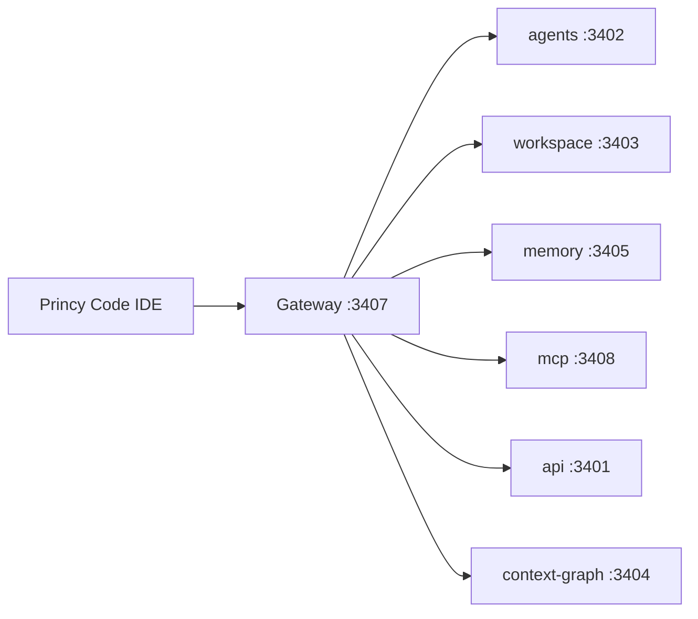

# Princy Code — Product Vision

Princy Code is a VS Code–compatible IDE powered entirely by the Princy AI gateway.

## Phase 1 (complete): VS Code Extension

- Package: `princy-ai.princy-assistant`
- Install: [VSCODE-EXTENSION.md](./VSCODE-EXTENSION.md)
- Gateway: `http://13.140.129.77:3407`

Features: chat (SSE), ghost text, inline explain/refactor/fix/tests, patch preview/apply/rollback, terminal IA, swarm panel, autonomous mode (opt-in), context graph indexing.

Status: **Alpha** — VSIX 0.1.0 funcional. Ver [PRINCY-CODE-ALPHA.md](./PRINCY-CODE-ALPHA.md).

## Phase 2 (in progress): Code-OSS Custom IDE

**FASE 67** — Princy Code Desktop Real.

Scaffold: `apps/princy-code/`

| File | Purpose |
|------|---------|
| `product.json.template` | Branding (`nameShort: Princy Code`, `dataFolderName: .princy-code`) |
| `scripts/patch-code-oss.mjs` | Bundle built-in extension + product patches |

### Objetivo

IDE desktop nativa (Explorer, Monaco, Terminal, Git, Extensions) com Princy AI built-in — **não** Electron shell abrindo URL.

### Documentação FASE 67

| Documento | Conteúdo |
|-----------|----------|
| [FASE-67-PRINCY-CODE-DESKTOP.md](./FASE-67-PRINCY-CODE-DESKTOP.md) | Visão, escopo, decisões |
| [FASE-67-AUDITORIA.md](./FASE-67-AUDITORIA.md) | Inventário do repositório |
| [FASE-67-ARQUITETURA.md](./FASE-67-ARQUITETURA.md) | Camadas, extensões, APIs |
| [FASE-67-CODE-OSS-STRATEGY.md](./FASE-67-CODE-OSS-STRATEGY.md) | Submodule, build, CI, legal |
| [FASE-67-ROADMAP-67.1-67.15.md](./FASE-67-ROADMAP-67.1-67.15.md) | Subfases, aceite, esforço |

### Roadmap Phase 2

1. Submodule `microsoft/vscode` → **67.1**
2. Branding completo Princy Code → **67.2**
3. Pre-install `princy-assistant` as built-in → **67.3**
4. Chat premium, ghost text, inline edit → **67.4–67.6**
5. Swarm, memory, workspace panels → **67.7–67.9**
6. Marketplace, MCP, observability, autonomous → **67.10–67.13**
7. Settings + instaladores Windows/Linux → **67.14–67.15**

### Instaladores

| Produto | Status | Artefato |
|---------|--------|----------|
| Electron shell (`apps/desktop`) | Legado transitório | `Princy-Code-Setup.exe` (Electron) |
| Code-OSS IDE (`apps/princy-code`) | **Alvo FASE 67** | `Princy-Code-Setup.exe` + AppImage |

### Build Code-OSS (FASE 68 — modernização)

Pin atual: **1.123.0** — ver [`apps/princy-code/VSCODE_PIN.md`](../apps/princy-code/VSCODE_PIN.md)

```powershell
cd D:\Projetos\Princy-AI-Editor
npm run princy-code:init-submodule
npm run princy-code:sync
npm run princy-code:patch
npm run princy-code:compile
npm run princy-code:build:win
```

Output: `apps/princy-code/dist/Princy-Code-Setup.exe`

Documentação: [FASE-68-CODE-OSS-MODERNIZATION.md](./FASE-68-CODE-OSS-MODERNIZATION.md)

## Architecture



All AI traffic goes through Princy — no third-party copilots in the UI.

## Related

- Electron shell (legado): [FASE-32-ELECTRON-DESKTOP.md](./FASE-32-ELECTRON-DESKTOP.md)
- Release 1.0: [FASE-65-RELEASE-1.0.md](./FASE-65-RELEASE-1.0.md)
- IA architecture: [ARQUITETURA-IA.md](./ARQUITETURA-IA.md)
