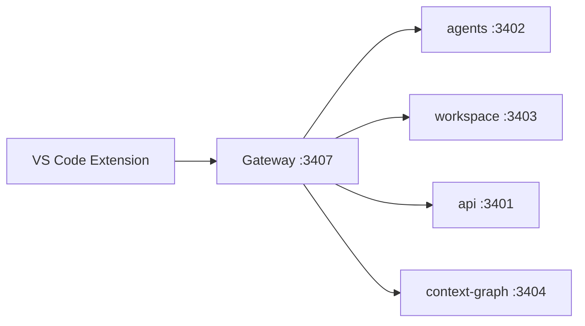

# Princy Code — Product Vision

Princy Code is a VS Code–compatible IDE powered entirely by the Princy AI gateway. Phase 1 ships as a **local VSIX extension**; Phase 2 adds a custom Code-OSS build.

## Phase 1 (current): VS Code Extension

- Package: `princy-ai.princy-assistant`
- Install: `docs/VSCODE-EXTENSION.md`
- Gateway: `http://13.140.129.77:3407`

Features: chat (SSE), ghost text, inline explain/refactor/fix/tests, patch preview/apply/rollback, terminal IA, swarm panel, autonomous mode (opt-in), context graph indexing.

## Phase 2 (future): Code-OSS Custom

Scaffold: `apps/princy-code/`

| File | Purpose |
|------|---------|
| `product.json.template` | Branding (`nameShort: Princy Code`, `dataFolderName: .princy-code`) |
| `scripts/patch-code-oss.mjs` | Bundle built-in extension + product patches |

### Roadmap

1. Submodule `microsoft/vscode`
2. Pre-install `@princy/vscode-extension` VSIX as built-in
3. Default theme: Princy Dark Neural
4. Windows/macOS/Linux installers (not in Phase 1)

## Architecture

All AI traffic goes through Princy — no third-party copilots in the UI.
