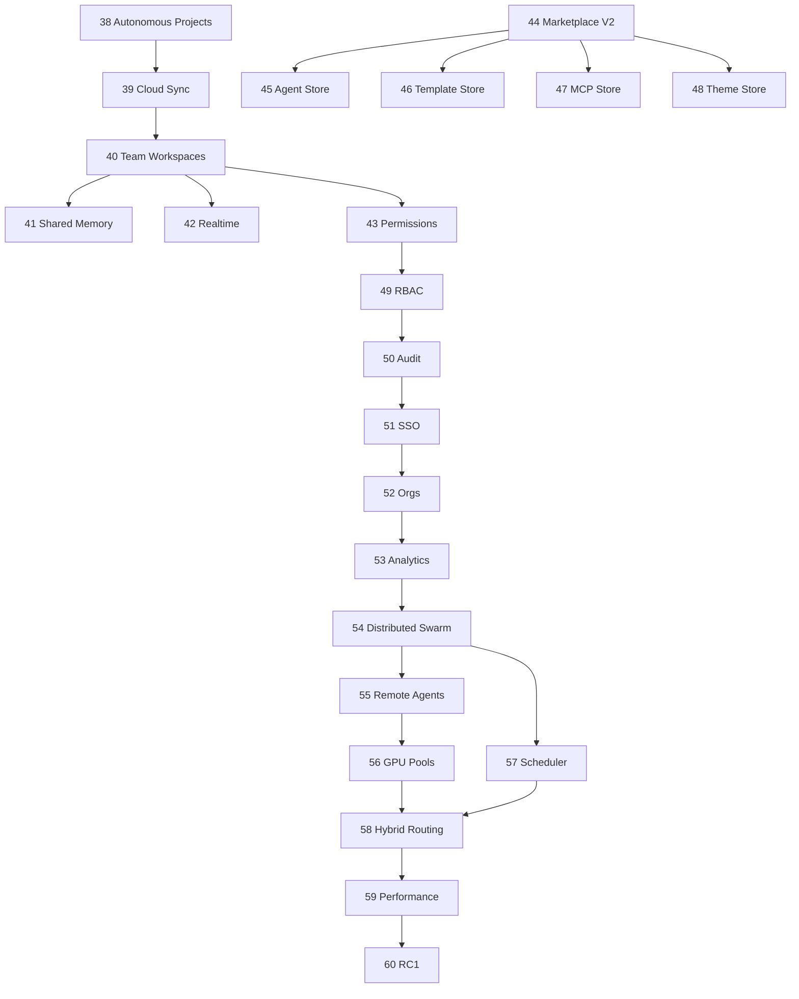

# ROADMAP 39–60 — Painel de Acompanhamento

**Última atualização:** 2026-06-06  
**Modo:** execução contínua, commit automático após validação  
**Baseline:** Fases 1–38 concluídas (`91f1365`)

## Dashboard de status

| Fase | Nome | Status | Commit | Data |
|------|------|--------|--------|------|
| 39 | Cloud Sync | done | `eea2291` | 2026-06-06 |
| 40 | Team Workspaces | done | `fedcff7` | 2026-06-06 |
| 41 | Shared Memory | done | `e493ede` | 2026-06-06 |
| 42 | Realtime Collaboration | done | `cfd6d0a` | 2026-06-06 |
| 43 | Project Permissions | done | `9db745c` | 2026-06-06 |
| 44 | Marketplace V2 | done | `5a9587b` | 2026-06-06 |
| 45 | Agent Store | done | `edf0838` | 2026-06-06 |
| 46 | Template Store | done | `4497b16` | 2026-06-06 |
| 47 | MCP Store | done | `1fb2203` | 2026-06-06 |
| 48 | Theme Store | done | `f08ecb4` | 2026-06-06 |
| 49 | RBAC Enterprise | done | `98d778d` | 2026-06-06 |
| 50 | Audit Logs | done | `8535944` | 2026-06-06 |
| 51 | SSO | done | `e752591` | 2026-06-06 |
| 52 | Organizations | done | `751884f` | 2026-06-06 |
| 53 | Usage Analytics | done | `7a54e9b` | 2026-06-06 |
| 54 | Distributed Swarm | done | `8d7e6f1` | 2026-06-06 |
| 55 | Remote Agents | done | `7294e87` | 2026-06-06 |
| 56 | GPU Pools | done | `d66382c` | 2026-06-06 |
| 57 | Cluster Scheduler | done | `4767679` | 2026-06-06 |
| 58 | Hybrid Routing | done | `c8ba41e` | 2026-06-06 |
| 59 | Performance Hardening | done | `2dd7c72` | 2026-06-06 |
| 60 | RC1 Release | done | `f0cc251` | 2026-06-06 |

## Métricas globais

| Métrica | Valor |
|---------|-------|
| Fases concluídas (39–60) | 22 / 22 |
| Commits (39–60) | 22 |
| Migrations novas | 14 |
| Endpoints novos | 35+ |
| Tag RC1 | `v1.0.0-rc.1` |

## Checklist padrão (cada fase)

- [x] Migration raw SQL + schema.prisma
- [x] Service + routes
- [x] Gateway proxy (se aplicável)
- [x] UI mínima (se aplicável)
- [x] `docs/FASE-XX-*.md` + REPORT
- [x] `docs/ARQUITETURA-IA.md`
- [x] Build workspaces alterados
- [x] `npm run health:linux`
- [x] PM2 restart
- [x] Commit `feat: implement phase XX <nome>`

## Dependências

## Riscos conhecidos

- `prisma generate` — ERR_REQUIRE_ESM; usar raw SQL + psql
- GitHub push — PAT read-only; commits locais OK
- Auth VPS — smoke tests com JWT assinado via `JWT_SECRET`

## Log de execução

### 2026-06-06 — Fases 41–60
- RC1 tag `v1.0.0-rc.1` @ `f0cc251`
- Scheduler BullMQ `:3409`
- Marketplace V2 + 4 stores
- RBAC + Audit + SSO scaffold + Analytics

### 2026-06-06 — Fase 39 Cloud Sync
- Endpoints: `/api/sync/push`, `/pull`, `/status`, `/queue`
- Migration: `20260606250000_cloud_sync_phase39`
- UI: `SyncStatusPanel`
