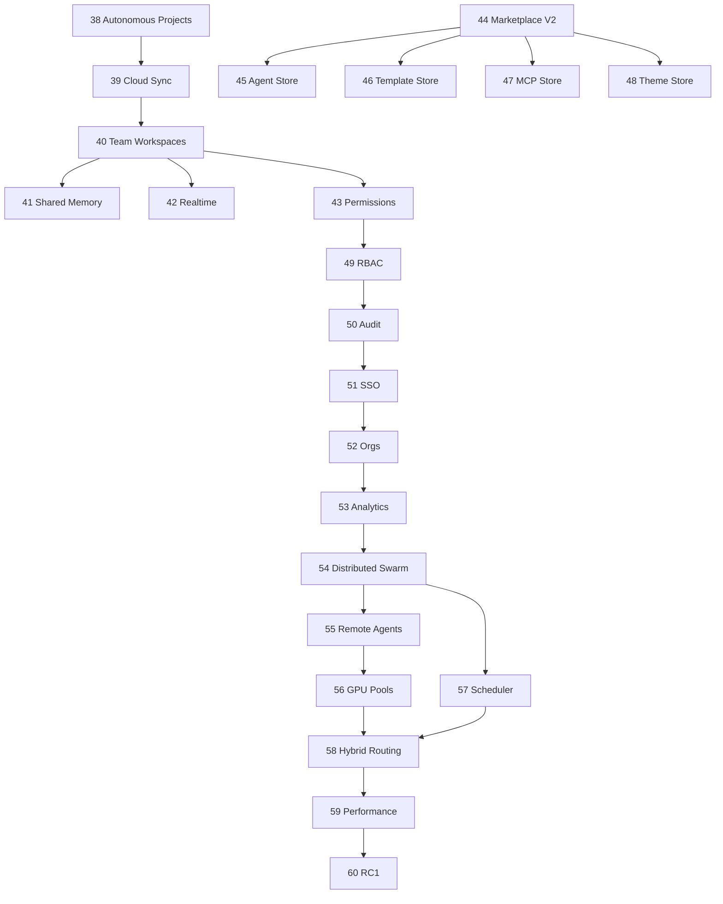

# ROADMAP 39–60 — Painel de Acompanhamento

**Última atualização:** 2026-06-06  
**Modo:** execução contínua, commit automático após validação  
**Baseline:** Fases 1–38 concluídas (`91f1365`)

## Dashboard de status

| Fase | Nome | Status | Commit | Data |
|------|------|--------|--------|------|
| 39 | Cloud Sync | done | `eea2291` | 2026-06-06 |
| 40 | Team Workspaces | done | `fedcff7` | 2026-06-06 |
| 41 | Shared Memory | done | `e493ede` | 2026-06-06 |
| 42 | Realtime Collaboration | done | `cfd6d0a` | 2026-06-06 |
| 43 | Project Permissions | done | _(pending commit)_ | 2026-06-06 |
| 44 | Marketplace V2 | pending | — | — |
| 45 | Agent Store | pending | — | — |
| 46 | Template Store | pending | — | — |
| 47 | MCP Store | pending | — | — |
| 48 | Theme Store | pending | — | — |
| 49 | RBAC Enterprise | pending | — | — |
| 50 | Audit Logs | pending | — | — |
| 51 | SSO | pending | — | — |
| 52 | Organizations | pending | — | — |
| 53 | Usage Analytics | pending | — | — |
| 54 | Distributed Swarm | pending | — | — |
| 55 | Remote Agents | pending | — | — |
| 56 | GPU Pools | pending | — | — |
| 57 | Cluster Scheduler | pending | — | — |
| 58 | Hybrid Routing | pending | — | — |
| 59 | Performance Hardening | pending | — | — |
| 60 | RC1 Release | pending | — | — |

## Métricas globais

| Métrica | Valor |
|---------|-------|
| Fases concluídas (39–60) | 4 / 22 |
| Commits (39–60) | 4 |
| Migrations novas | 4 |
| Endpoints novos | 11 |

## Checklist padrão (cada fase)

- [ ] Migration raw SQL + schema.prisma
- [ ] Service + routes
- [ ] Gateway proxy (se aplicável)
- [ ] UI mínima (se aplicável)
- [ ] `docs/FASE-XX-*.md` + REPORT
- [ ] `docs/ARQUITETURA-IA.md`
- [ ] Build workspaces alterados
- [ ] `npm run health:linux`
- [ ] PM2 restart
- [ ] Commit `feat: implement phase XX <nome>`

## Dependências

## Riscos conhecidos

- `prisma generate` — ERR_REQUIRE_ESM; usar raw SQL + psql
- GitHub push — PAT read-only; commits locais OK
- Auth VPS — smoke tests com JWT assinado via `JWT_SECRET`

## Log de execução

### 2026-06-06 — Fase 39 Cloud Sync
- Endpoints: `/api/sync/push`, `/pull`, `/status`, `/queue`
- Migration: `20260606250000_cloud_sync_phase39`
- UI: `SyncStatusPanel`
