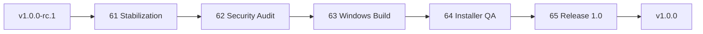

# ROADMAP 61–65 — RC1 → Release 1.0

**Última atualização:** 2026-06-07  
**Modo:** execução documentada, **sem commit automático**  
**Baseline:** RC1 `v1.0.0-rc.1` @ `4730e03`

## Dashboard de status

| Fase | Nome | Status | Data |
|------|------|--------|------|
| 61 | Stabilization | done | 2026-06-07 |
| 62 | Security Audit | done | 2026-06-07 |
| 63 | Windows Build Pipeline | done | 2026-06-07 |
| 64 | Installer QA | done | 2026-06-07 |
| 65 | Release 1.0 | done | 2026-06-07 |

## Métricas

| Métrica | Valor |
|---------|-------|
| Fases concluídas (61–65) | 5 / 5 |
| Versão alvo | `v1.0.0` |
| Tag RC1 anterior | `v1.0.0-rc.1` |
| Smoke autenticado | 20 rotas |
| Health checks | 16/16 |

## Checklist padrão (cada fase)

- [x] Auditoria / checklist executado
- [x] `docs/FASE-XX-*.md` + REPORT
- [x] `npm run health:linux` + `npm run auth-smoke`
- [x] Sem novas funcionalidades
- [x] Sem novos serviços
- [x] Aguardar aprovação humana para commit

## Dependências

## Log de execução

### 2026-06-07 — Fases 61–65
- Auditoria estabilização + security documentada
- `scripts/windows-build-check.ps1` + CI `desktop:dist`
- Branding GA: Princy Code `v1.0.0`
- `CHANGELOG.md`, `docs/RELEASE-1.0.md`, tag local `v1.0.0`
